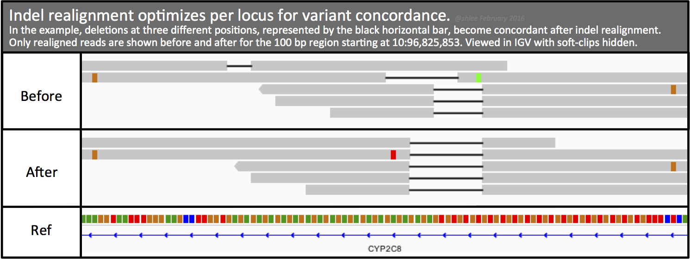

# Step 7: Local realignment around Insertions/Deletions

Local realignment allows us to correct mapping errors made by genome aligners and make read alignments more consistent in regions that contain indels.

Genome aligners can only consider each read independently, and the scoring strategies they use to align reads relative to the reference limit their ability to align reads well in the presence of indels. Depending on the variant event and its relative location within a read, the aligner may favor alignments with mismatches or soft-clips instead of opening a gap in either the read or the reference sequence. In addition, the aligner's scoring scheme may use arbitrary tie-breaking, leading to different, non-parsimonious representations of the event in different reads.

In contrast, local realignment considers all reads spanning a given position. This makes it possible to achieve a high-scoring consensus that supports the presence of an indel event. It also produces a more parsimonious representation of the data in the region .

 then realigns the reads in these regions using a consensus model that takes all reads in the alignment context together

In the following command, IndelRealigner takes a coordinate-sorted and indexed BAM and a target intervals file generated by RealignerTargetCreator. IndelRealigner then performs local realignment on reads coincident with the target intervals using consenses from indels present in the original alignment. The resulting coordinate-sorted and indexed BAM contains the same records as the original BAM but with changes to realigned records and their mates. Our tutorial's two IGV screenshots show realigned reads in two different loci. For simplicity, the screenshots show the subset of reads that realigned.


By default, and in this command, IndelRealigner applies the USE_READS consensus model. This is the consensus model we recommend because it balances accuracy and performance. To specify a different model, use the -model argument. The KNOWNS_ONLY consensus model constructs alternative alignments from the reference sequence by incorporating any known indels at the site, the USE_READS model from indels in reads spanning the site and the USE_SW model additionally from Smith-Waterman alignment of reads that do not perfectly match the reference sequence.

The KNOWNS_ONLY model can be sufficient for preparing data for base quality score recalibration. It can maximize performance at the expense of some accuracy. This is the case only given the known indels file represents common variants for your data. If you specify -model KNOWNS_ONLY but forget to provide a VCF, the command runs but the tool does not realign any reads.

If you encounter out of memory errors, try these options. First, increase max java heap size from -Xmx8G. To find a system's default maximum heap size, type java -XX:+PrintFlagsFinal -version, and look for MaxHeapSize. If this does not help, and you are jointly processing data, then try running indel realignment iteratively on smaller subsets of data before processing them jointly.

IndelRealigner performs local realignment without downsampling. If the number of reads in an interval exceeds the 20,000 default threshold set by the -maxReads parameter, then the tool skips the region.
The tool has two read filters, BadCigarFilter and MalformedReadFilter. The tool processes reads flagged as duplicate.




Since I am continuing the use of gatk3[^1], I still have to use Paul's environment: `conda activate /mnt/shared/scratch/pjohnsto/apps/conda/envs/gatk3/`


```
gatk3 \
-T IndelRealigner \
-R ./PATH/TO/dmel-all-chromosome-r6.54.fasta  \
-I ./PATH/TO/sampleName_library-dedup_rg.bam \
-targetIntervals ./PATH/TO/sampleName_library-dedup_rg.list \
-o ./PATH/TO/sampleName_library-dedup_rg_InDel.bam
```
| Command      | Description |
| ----------- | ----------- |
| `-T` | tool from gatk3 |
| `-R` | reference .fasta file |
| `-I` | input .bam file |
| `-targetIntervals` | input .list file of where the indels are |
| `-o` | output .bam file of indels |

For the next step, you could either just loop through the list of files or write them out to a text file: `ls *.bam > BAMlist.txt` and check `less BAMlist.txt` to make sure it looks alright.


[^1]: <https://github.com/broadinstitute/gatk-docs/blob/master/gatk3-tutorials/(howto)_Perform_local_realignment_around_indels.md>

https://github.com/broadinstitute/gatk-docs/blob/master/blog-2012-to-2019/2016-06-21-Changing_workflows_around_calling_SNPs_and_indels.md?id=7847
https://github.com/lczech/popoolation2
https://speciationgenomics.github.io/variant_calling/
