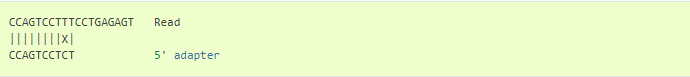

# Step 2: Trimming

Raw FASTQ reads will be trimmed for a minimum BQ >18 and a minimum length (fragments greater than 75 base pairs) using cutadapt[^1]. It uses a semiglobal alignment algorithm (free-shift, ends-free or overlap alignment). In a regular (global) alignment, the two sequences are compared from end to end and all differences occuring over that length are counted. In semiglobal alignment, the sequences are allowed to freely shift relative to each other and differences are only penalized in the overlapping region between them:


The prefix ELE and the suffix ASTIC do not have a counterpart in the respective other row, but this is not counted as an error. The overlap *FANT* has a length of four characters.

To find optimal overlap alignment, alignment scores would assign a positive value to matches, and negetaive values to mismatches, insertions and deletions, resulting in a total score, but this isn't that intuitive. So Marcel's aligorithm uses "unit costs" which count mismatches, insertions and deletions as one error. This returns a single parameter, the maximum error rate, which helps us decide how many errors are acceptable.

Optimization criteria is to consider the alignment optimal that maximizes the overlap between the two sequences, as long as the allowed error rate is not exceeded.

## Method: 

1. Consider all possible overlaps between the two sequences and compute an alignment for each, minimizing the total number of errors in each one. (different adapter types are taken into account: Only those overlaps that are actually allowed by the adapter type are actually considered.)
2. Keep alignments that do not exceed the specified maximum error rate.
3. Keep alignments that have a maximal number of matches (that is, there is no alignment with more matches) and uses both edit distance (for all possible overlaps between the read and the adaptor) and score (decides which overlap is the best one based on a matrix).
     

   The trimmed read is `CCTGAGAGT`.

4. If there are multiple alignments with the same number of matches, then keep only those that have the smallest error rate.
5. If there are still multiple candidates left, choose the alignment that starts at the leftmost position within the read.

:memo: **Note**: both Compressed in- and output files are supported (.gz). 

## Code 
```
cutadapt \
-q 18 \
--minimum-length 75 \
-o ./PATH/TO/1_cutadapt_trimmed/filename_trimmed-read1.fq.gz \
-p ./PATH/TO/1_cutadapt_trimmed/filename_trimmed-read2.fq.gz \
-b ACACTCTTTCCCTACACGACGCTCTTCCGATC \
-B CAAGCAGAAGACGGCATACGAGAT \
-O 15 \
-n 3 \
./PATH/TO/Raw_Data/filename_1.fq.gz \
./PATH/TO/Raw_Data/filename_2.fq.gz
```

| Command      | Description |
| ----------- | ----------- |
| `-q`     | trims low-quality ends from reads, with a specified single cutoff value which trims from the 3' end[^2] |
| `--minimum length`   | Discard processed reads that are shorter than 75 bp |
| `-o` | output file name |
| `-p` | output file name for second read in the pair |
| `-b` | detects and trims adaptor sequence on forward read |
| `-B` | detects and trims adaptor sequence on reverse read |
| `-O` | sets the minimum overlap parameters for adapters listed via the -b option |
| `-n` | looks to trim a minimum of 3 adaptor sequences from one read |
| - | input file 1.fq.gz |
| - | input file 2.fq.gz |

To keep things neat, I keep the output in the same folder ("1_cutadapt_trimmed folder") 

For more information about this tool, see <https://cutadapt.readthedocs.io/en/stable/>

[^1]: Martin, M. (2011). Cutadapt removes adapter sequences from high-throughput sequencing reads. EMBnet. journal, 17(1), 10-12.
[^2]: For Illumina reads, this is sufficient as their quality is high at the beginning, but degrades towards the 3’ end. 

